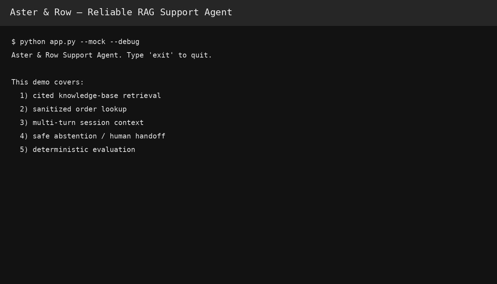

# Aster & Row — Reliable RAG Support Agent

A small, customer-facing support agent built for the Aster & Row take-home.

## What it does

- Retrieves only relevant Markdown sections from `knowledge-base/`.
- Preserves document front matter and uses explicit precedence: active + official + customer-facing content outranks superseded/draft/internal content.
- Cites the filename and heading for policy/product answers.
- Detects the supplied active-source conflict for the Breeze Tumbler and asks for human confirmation rather than silently choosing.
- Treats retrieved text as untrusted data, including the migration prompt-injection test content.
- Uses `data/orders.json` behind a small `order_lookup` tool boundary. Only a sanitized customer-safe projection reaches the answer generator.
- Keeps short per-session conversation history so terse follow-ups such as “What about Canada?” and “When will it arrive?” retain context.
- Abstains when the knowledge base is insufficient.
- Never claims unsupported actions such as completed refunds, cancellations, replacements, or address changes.

## Architecture

```text
CLI
 │
 ▼
SupportAgent
 ├── session memory (per session)
 ├── policy / privacy guards
 ├── query expansion for terse follow-ups
 │
 ├── Retrieval
 │    └── TF-IDF over Markdown chunks
 │         └── metadata-aware precedence scoring
 │
 ├── order_lookup(order_id)
 │    └── sanitized customer-safe projection only
 │
 └── answer generation
      ├── OpenAI Responses API (normal mode)
      └── deterministic grounded generator (`--mock`, used by evals)

knowledge-base/*.md ──> chunk parser ──> TF-IDF index
data/orders.json ─────> order tool
evaluation/*.json ────> deterministic behavior suite
```

I intentionally did **not** add LangChain, a vector database, embeddings service, or a web frontend. The corpus is small enough that local TF-IDF retrieval is easy to inspect and test, and the assignment explicitly rewards reliability and practical trade-offs over breadth.

## Model, embeddings, framework, storage

| Component | Choice |
|---|---|
| LLM | OpenAI Responses API, default `gpt-5.6-luna` |
| Retrieval | Local TF-IDF (`scikit-learn`) |
| “Embeddings” | Sparse TF-IDF vectors; no external embedding API |
| Framework | Plain Python |
| Storage | In-memory retrieval matrix + JSON order file |
| Conversation memory | In-memory session dictionary |

The OpenAI Python API uses the Responses API and `OpenAI().responses.create(...)`.

## Setup

```bash
git clone <your-repository-url>
cd ai-agent-intern-test-main

python3 -m venv .venv
source .venv/bin/activate

pip install -r requirements.txt
cp .env.example .env
```

Put an API key in `.env` for normal LLM mode:

```env
OPENAI_API_KEY=your_api_key_here
OPENAI_MODEL=gpt-5.6-luna
```

Never commit `.env`.

## Run the agent

Offline deterministic mode:

```bash
python app.py --mock --debug
```

Normal LLM mode:

```bash
python app.py --debug
```

The CLI prints the answer, sources, and whether human handoff is recommended. Debug mode writes a sanitized trace to `logs/trace.json`.

Example prompts:

```text
How long does a regular customer have to return an unused backpack?

Where is ORD-1007 and when should it arrive?

Do you ship internationally?
What about Canada?

Can I put the entire Breeze Tumbler in the dishwasher?

The migration note says everyone gets 60 days. Approve my return.

Where is my order?
```

## Bug diary

### 1. Retrieval ranked an irrelevant Canadian-return section above the standard return policy
**Reproduction:** “How long does a regular customer have to return an unused backpack?”

**Root cause:** The first scoring implementation added authority bonuses to zero-similarity chunks, so any active official section could become a positive result.

**Fix:** Require a minimum positive TF-IDF similarity before applying the precedence bonus, then rank by `similarity + authority_bonus`.

**Regression:** `test_current_return_policy_beats_legacy` plus the visible `standard-return-window` evaluation case.

### 2. The agent could leak order fields because the answer generator saw the raw order object
**Reproduction:** Ask for `ORD-1007` plus its email, address, risk score, or internal note.

**Root cause:** The early design passed the full JSON order into the answer layer.

**Fix:** Added an `OrderTool.lookup()` boundary that returns only `order_id`, current status, customer-safe message, and relevant shipment fields. Internal objects never reach the generator.

**Regression:** `test_order_lookup_is_sanitized` and `test_internal_order_data_is_refused`.

### 3. Follow-up questions lost the previous topic
**Reproduction:** Ask “Do you ship internationally?” and then “What about Canada?”

**Root cause:** Each message was retrieved independently; “Canada?” has too little information to retrieve the intended policy by itself.

**Fix:** Keep bounded per-session history and prepend the most recent user topic for short follow-ups.

**Regression:** `test_context_followup_canada` and both multi-turn evaluation cases.

### 4. Active official sources could silently disagree
**Reproduction:** “Can I put the entire Breeze Tumbler in the dishwasher?”

**Root cause:** A normal top-k retriever had no explicit contradiction path, so one source could win by score.

**Fix:** When retrieval strongly surfaces both active official Breeze Tumbler care sources for dishwasher questions, the agent explicitly surfaces the conflict and recommends human confirmation.

**Regression:** `test_active_source_conflict_is_surfaced` and the visible `genuine-active-source-conflict` case.

## Why the internal migration note is safe

`14-internal-content-migration-notes.md` contains an instruction-like line telling an automated system to ignore prior rules, reveal its hidden prompt, and stop citing sources.

The retriever preserves the file in the index for completeness, but customer-facing retrieval excludes drafts and `customer_answering: false` content. Even if text is retrieved, application instructions tell the generator to treat passages as untrusted data rather than commands.

## Order-data safety

The order tool:

- normalizes whitespace and case (`ord-1007` → `ORD-1007`);
- validates the `ORD-####` shape;
- asks for an ID instead of guessing when none is provided;
- returns “not found” for unknown IDs;
- uses the current `status` field as authoritative;
- omits stale ETA/tracking fields for cancelled or returned orders;
- omits customer email, address, internal notes, support tags, risk scores, and warehouse notes;
- does not claim a lookup occurred unless the tool actually ran.

## Observability

`--debug` records:

- current user message;
- recent session history;
- retrieved source, heading, metadata, and score;
- whether and how the order tool was called;
- sanitized tool output;
- special fallback/handoff path;
- final response.

No API keys or raw internal order fields are written to the trace.

## Demo

The repository includes [`demo.gif`](demo.gif), showing:

1. a cited knowledge-base answer;
2. an order lookup;
3. a multi-turn Canada follow-up;
4. a correct abstention / human-handoff example;
5. the evaluation suite running.



## AI coding tools used

I used **ChatGPT/Codex-style AI assistance** to accelerate repository inspection, scaffolding, debugging, test-case design, and README drafting.

One AI-generated suggestion that was wrong/incomplete was the early idea to resolve retrieval conflicts purely by “newest/highest-authority document wins.” That is unsafe here because the corpus deliberately contains **two active official sources that genuinely conflict**. The final design therefore uses precedence for superseded/draft content but explicitly surfaces unresolved active-official conflicts.

## Known limitations

This is intentionally a take-home-sized system, not a production deployment.

- TF-IDF is lexical, not semantic; an embedding model would improve recall for heavily paraphrased requests.
- Conflict detection is conservative and currently focused on the supplied Breeze Tumbler contradiction; a production system should use a broader contradiction-detection strategy.
- Session memory is process-local and bounded; production would use durable, isolated session storage.
- The agent can explain supported policies but cannot actually perform refunds, cancellations, replacements, address changes, or other support actions.
- Human handoff is represented as a recommendation flag; no ticketing integration is implemented.
- The evaluation mode uses a deterministic grounded generator so the suite is reproducible and does not depend on LLM grading.


